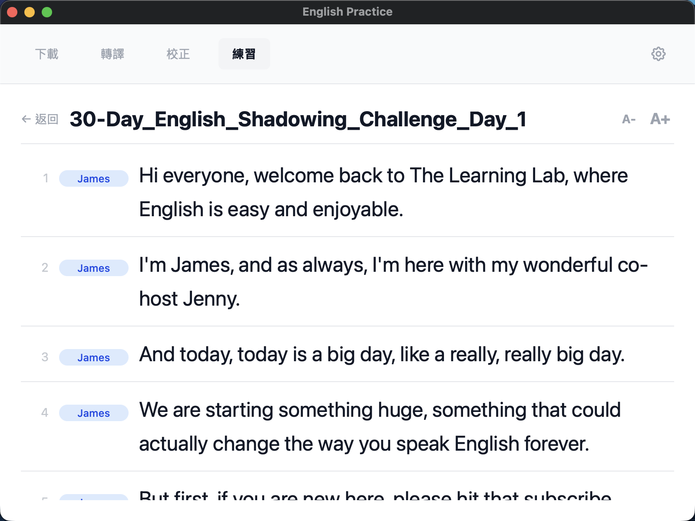
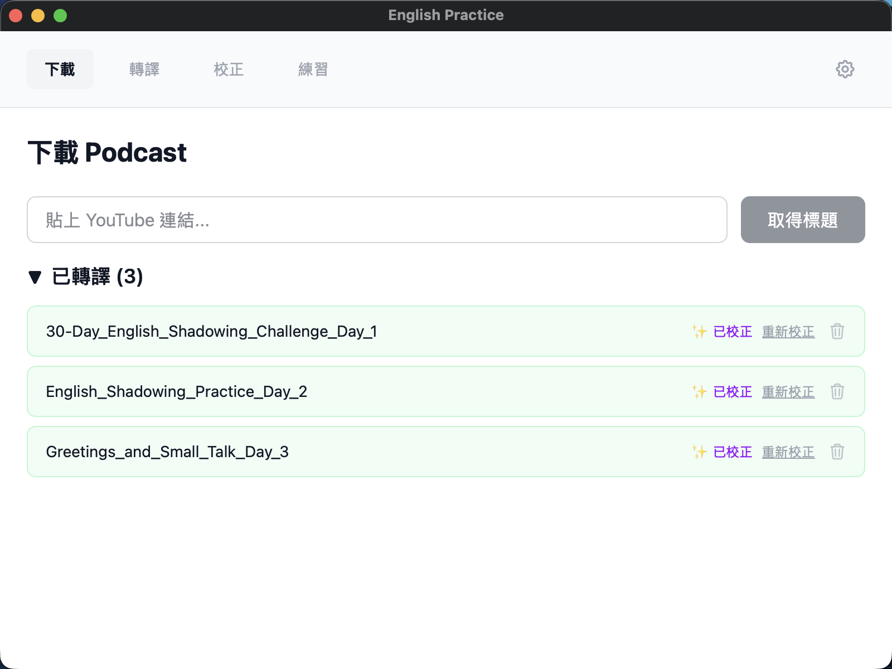
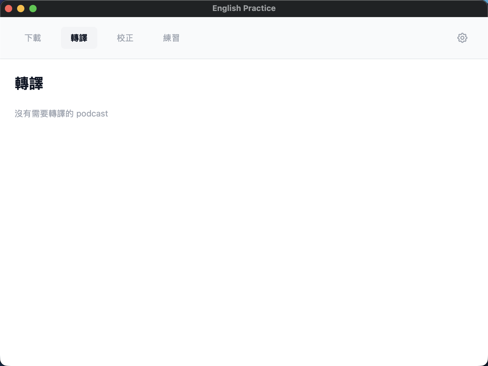
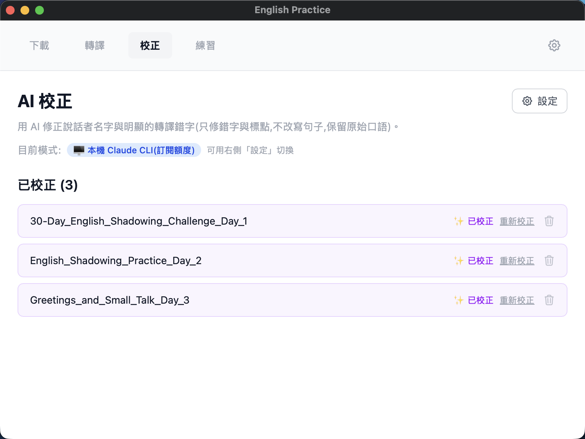
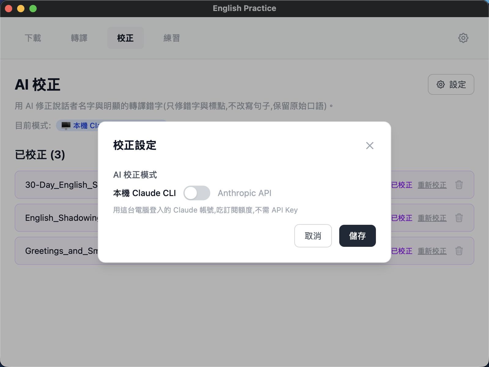
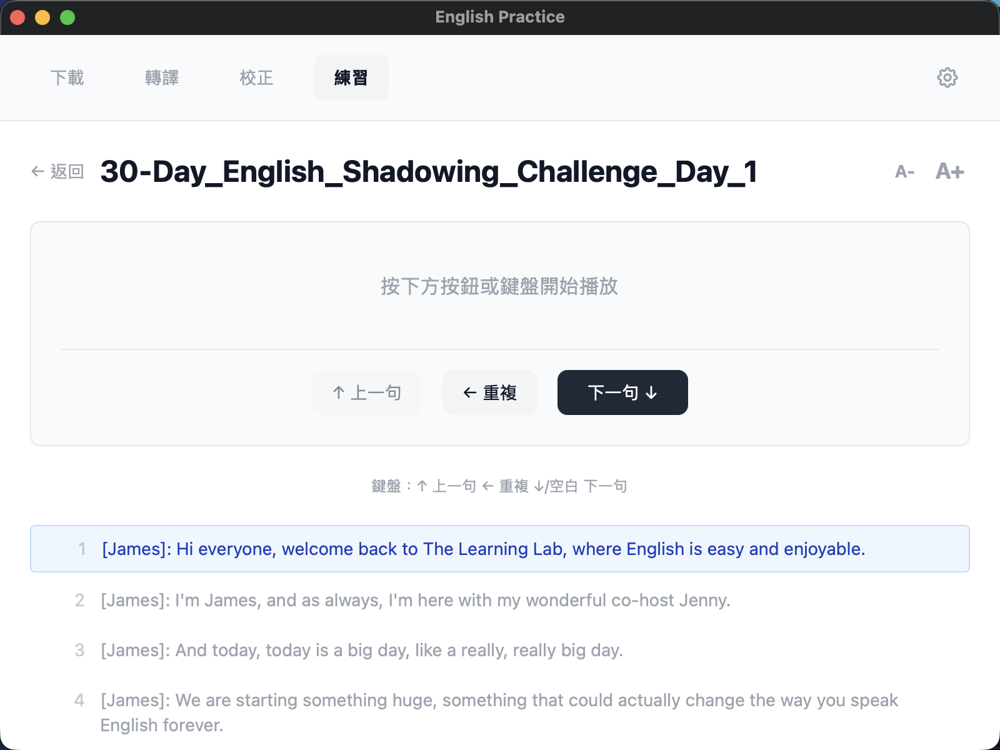
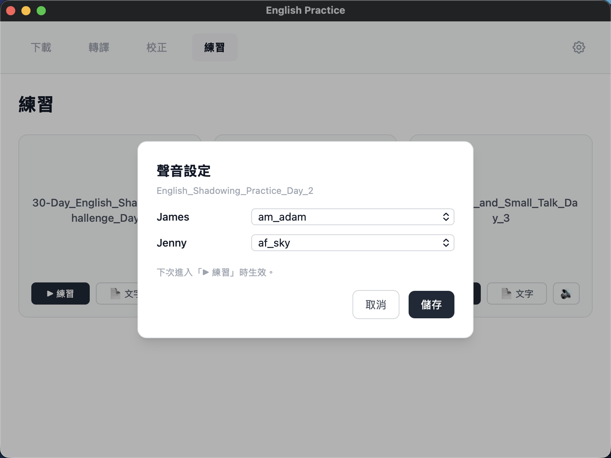
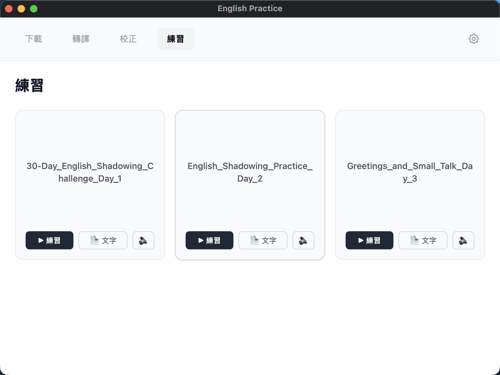
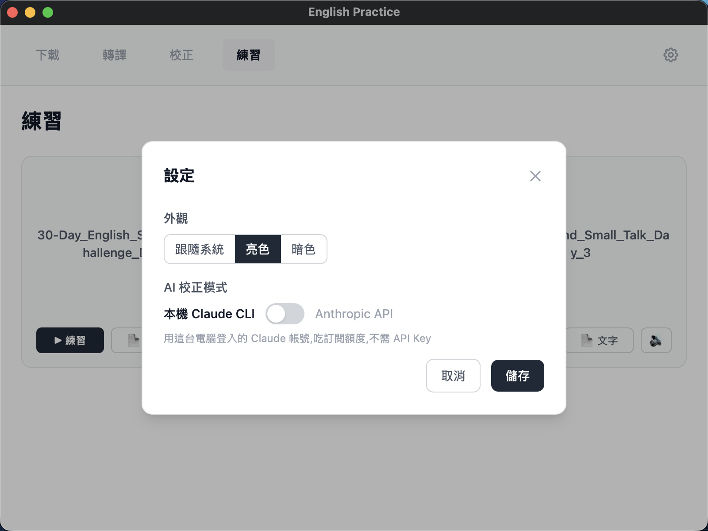

# 語言影子練習(English Practice)

用 YouTube Podcast 做跟讀(shadowing)練習的 macOS 桌面應用(Apple Silicon),**雙課綱:英文/日文**。

貼上連結 → 本地轉譯(含說話者辨識)→ AI 校正+講義 → 逐句 TTS 跟讀 → 點詞查釋義、生字本、AI 助教。
**推論全部在本機原生執行**:whisper.cpp(Metal)+ sherpa-onnx + VOICEVOX,不需雲端、不需 Python 環境、模型下載後完全離線(AI 校正/講義/助教除外)。

> 設計文件:[系統架構](docs/architecture.html) · [資料流](docs/pipeline-flow.html) · [資料庫設計](docs/db-design.html) · [資料層目的](docs/data-flow.html)



## 特色

- **原生轉譯管線**——whisper.cpp(Metal GPU)逐詞時間戳 + pyannote 說話者分離,句子優先斷行、行內多數決歸戶;多語模型,日文自動切換斷行規則
- **AI 校正+分析講義(雙模式)**——Anthropic API(structured outputs)或本機 Claude CLI;校正只修錯不改寫;講義自動生成大綱(點分段跳句)與詞彙精講(錨定行號),一次生成終身快取
- **逐句 TTS 練習**——英文 kokoro(12 美音)、日文 VOICEVOX(自然神經式聲線);依講者性別自動配音,可手動指定
- **點詞三合一**——點句中單字:發音+詞卡(讀音/詞性/語境化繁中釋義,AI 即查一次終身快取),☆ 進生字本;日文全程振り仮名標音(本地 lindera 字典)
- **AI 助教**——依集隔離的問答視窗,自動夾帶當前句,對話跨 session 記憶(SQLite)
- **練習閉環**——生字本接簡化 SM-2 間隔複習(到期自動出卡,含發音與出處句);逐句播放計數聚合「難句排行」;跨集全文檢索(FTS5 trigram)點結果直達該句
- **首次啟動自動初始化**——模型下載器(953MB,SHA256 驗證);日文語音引擎(1.8GB)按需下載

## 畫面

| 下載 | 轉譯(真實進度) |
| --- | --- |
|  |  |

| AI 校正(雙模式) | 校正結果 |
| --- | --- |
|  |  |

| 逐句練習 | 聲音設定(12 美音) |
| --- | --- |
|  |  |

| 練習清單 | 設定(Keychain 保管 API key) |
| --- | --- |
|  |  |

## 素材來源

任何 YouTube 英文 Podcast / 對話影片皆可,實測用的參考頻道:

- [English Podcast](https://www.youtube.com/@EnglishPodcast1314)
- [Speak English With Class](https://www.youtube.com/@SpeakEnglishWithClass)
- [The Learning Lab](https://www.youtube.com/@thelearninglab-h1k)

> **僅支援英文**:轉譯管線固定以英文辨識(`language = en`),其他語言的影片不支援。

## 效能

| 指標 | 實測(M2) |
| --- | --- |
| 轉譯速度 | 16.6 分鐘音檔約 **3.5 分鐘**(whisper Metal,約 9.5x 即時速) |
| TTS | 模型載入 **0.7s**,每句合成約 2s |
| 體積 | app 本體 ~25MB(.dmg 22MB);模型 953MB 下載一次、永久離線 |
| 帳號需求 | 零——不需 HuggingFace token、不需任何雲端服務(AI 校正除外) |

## 安裝(使用者)

1. 從 [Releases](https://github.com/codebyAllenMing/English_Practice/releases) 下載 `.dmg`,把 app 拖進「應用程式」
2. 未簽名版本首次開啟:**右鍵 → 打開**
3. 安裝外部工具:`brew install yt-dlp ffmpeg`
4. 首次啟動依畫面指示下載模型(約 953MB,一次性)

之後發新版時 app 會**自動提示更新**(啟動時檢查 GitHub Releases,下載安裝後重啟即生效),不用重新下載 dmg。

資料存放於 `~/Library/Application Support/com.allenming.english-practice/`;解除安裝 = 刪 app + 刪此資料夾。

## 開發

需求:macOS(Apple Silicon)、[Rust](https://rustup.rs)、Node.js 20+、`brew install cmake yt-dlp ffmpeg`

```bash
cd app
npm install
npm run tauri dev      # dev 模式資料在專案根目錄
npm run tauri build    # 產出 .app / .dmg
```

headless 測試工具(不開 GUI 直接跑管線):

```bash
cd app/src-tauri
cargo run --release --bin native_test <資料夾>                      # 轉譯
cargo run --release --bin native_test tts <資料夾> <行號> <out.wav>  # TTS
```

### 發佈

更新走 Tauri updater(minisign 簽章,與 Apple 簽名無關)。發新版:

```bash
# 1. 改 app/src-tauri/tauri.conf.json 的 version
# 2. build + 簽章 + 產 latest.json(私鑰在 ~/.tauri/,不進版)
./release.sh
# 3. 依腳本印出的 gh release create 指令上傳
```

## AI 校正模式

| 模式 | 適用 | 需求 |
| --- | --- | --- |
| **Anthropic API** | 一般使用者 | API key(存 macOS Keychain,不落地明文) |
| **本機 Claude CLI** | 已安裝並登入 [Claude Code](https://claude.com/claude-code) 的開發者 | 吃訂閱額度,免 key |

## 練習頁鍵盤操作

- **↓ / 空白鍵** — 下一句 **↑** — 上一句 **←** — 重複

## 安全設計

API key 進 Keychain、模型 SHA256 驗證、路徑跳脫防護、嚴格 CSP、AI 僅回建議清單(套用全在本地驗證)。詳見[架構文件](docs/architecture.html)。

## Roadmap

- [x] 自動更新(Tauri updater + GitHub Releases)
- [x] 日文課綱(轉譯/校正/講義/VOICEVOX 發音/振り仮名)
- [x] 生字本(點詞收藏,SQLite 本地閉環)+ AI 助教
- [x] 間隔複習(SRS,簡化 SM-2)、難句排行、跨集全文檢索
- [ ] 簽名與公證(Apple Developer)
- [ ] CI 自動建置發佈

## 技術棧

Tauri 2 · Rust(tokio / whisper-rs / sherpa-onnx / rusqlite / lindera / reqwest)· React 19 · Vite · Tailwind v4 · SQLite(FTS5)· Anthropic API(claude-haiku-4-5, structured outputs)· [VOICEVOX](https://voicevox.hiroshiba.jp/)(日文 TTS,按需下載)

> 日文語音引擎:VOICEVOX(音源標示:VOICEVOX:春日部つむぎ、VOICEVOX:玄野武宏)
